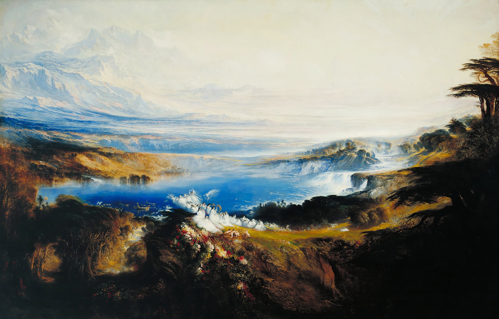
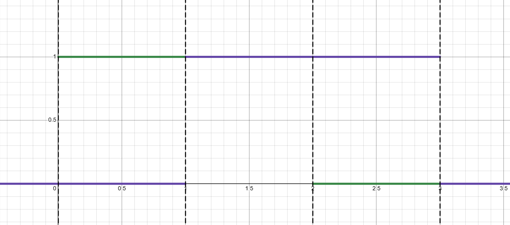
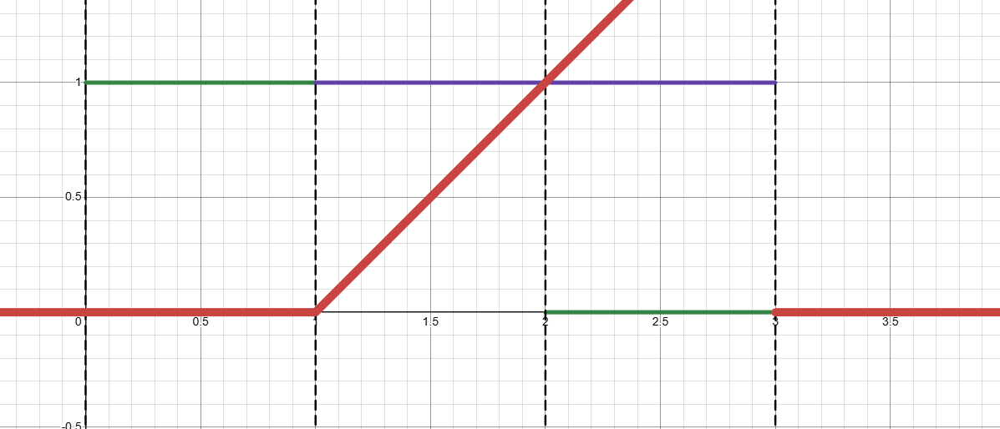
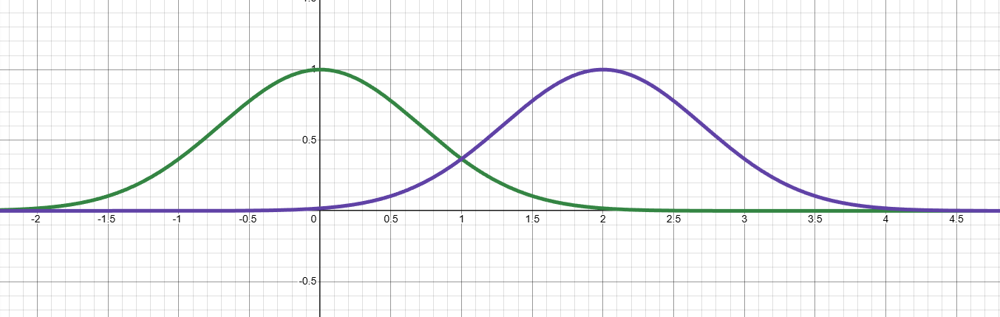
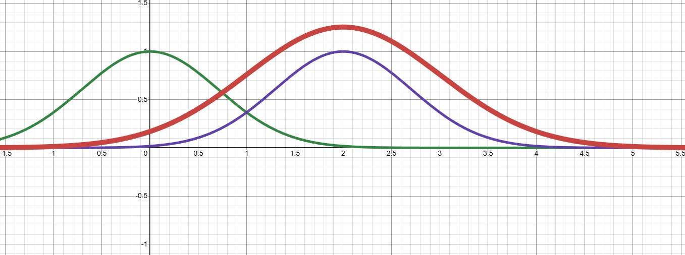
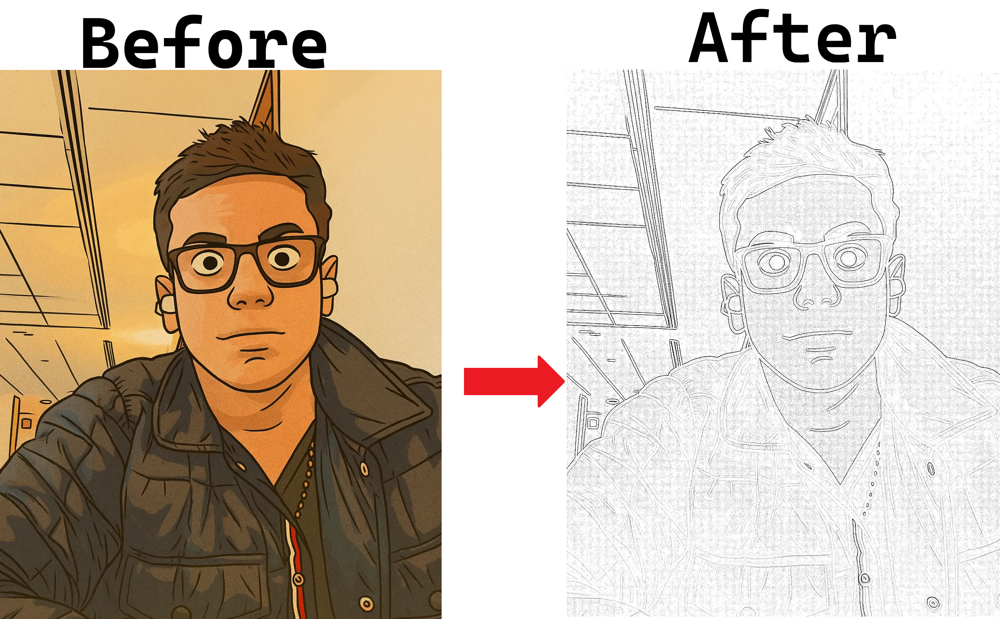
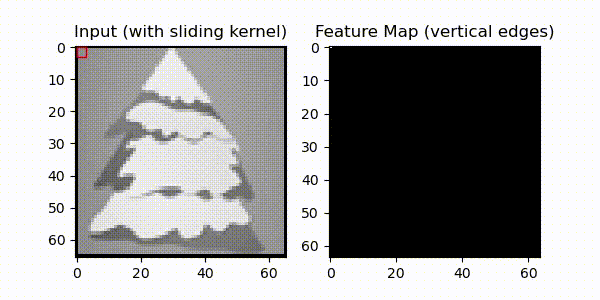
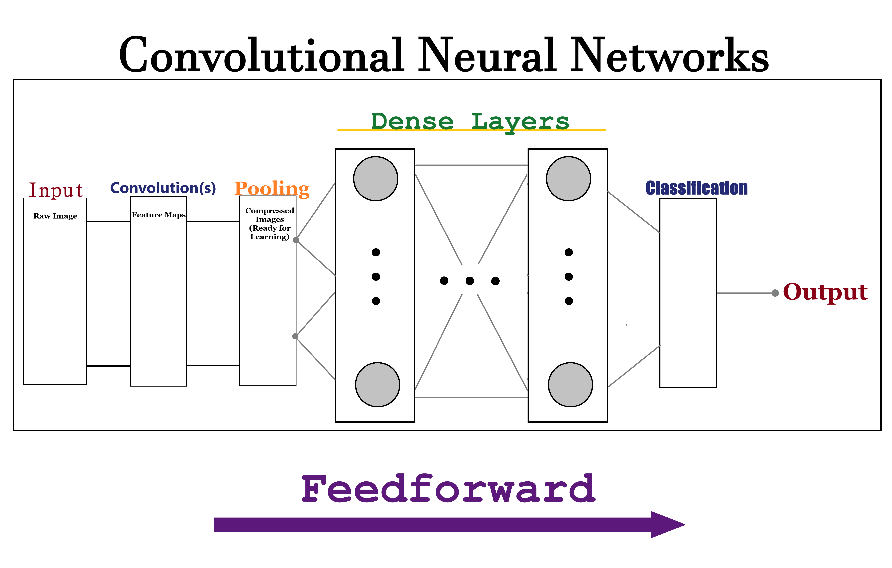

# Convolutional Neural Networks



*Note: This writeup assumes background knowledge about [backpropagation and dense networks](https://github.com/intelligent-username/Backpropagation)

A Convolutional Neural Network (CNN) is a type of deep learning algorithm primarily used for image recognition and processing. It consists of multiple layers that automatically learn hierarchical features from input images through convolutional operations. Unlike **Dense** networks, **Convolutional** networks use local connectivity and weight sharing via convolutional layers, allowing them to detect patterns that are spatially invariant across the image. CNNs are widely used in computer vision tasks such as object detection, classification, and segmentation.

## Outline

- [Convolutional Neural Networks](#convolutional-neural-networks)
  - [Outline](#outline)
  - [Motivation](#motivation)
  - [Terminology](#terminology)
  - [Math](#math)
    - [Convolutions](#convolutions)
      - [Kernels](#kernels)
      - [Feature Maps](#feature-maps)
    - [Size, Strides, Padding, and Pooling](#size-strides-padding-and-pooling)
    - [Backprop and Review](#backprop-and-review)
    - [Example](#example)
  - [Real-Life Architecture](#real-life-architecture)
    - [Data Pipeline Principles](#data-pipeline-principles)
    - [AlexNet](#alexnet)
    - [VGG](#vgg)
    - [ResNet](#resnet)
  - [Other Considerations](#other-considerations)
  - [Project Details](#project-details)
    - [File structure](#file-structure)
    - [Installation](#installation)
    - [Data](#data)

## Motivation

While regular feed-forward Dense networks are good for finding connections between unrelated/linearly independent data points, a lot of the tasks that we need to do involve patterns that are spatially related and more complex. If we want to classify or segment a video, for example, it won't be enough to look at its pixels in sequence and figure out what they have in common. CNNs are designed to take advantage of the spatial structure in data by extracting local features through convolutional layers. For example, if you have an image that you know represents some English character, you may take out its vertical and horizontal lines using a convolutional operation. You may then extract the image's luminance at certain points, and train the model on these 3 features in order to teach it how to classify the characters that you're working with.

When working with unspecialized MLPs (Dense networks), the model has to learn all of these spatial relationships from scratch. Also, its growth complexity is $O(n^2)$, which makes it very expensive to construct. In order to make a regular Dense network work for image recognition, you would have to flatten the image into a 1D array, which would destroy all of the spatial relationships between pixels. The model would then need many, many layers and neurons to be able to learn these relationships, which would make it very slow and inefficient.

By building this feature-specific complexity into your model, you prepare it to be specialized for the specific context that it's being used for. Of course, this makes CNNs a lot more complicated to construct, but it's usually worth it. As a result, CNNs tend to not only be more efficient in terms of the number of parameters, but they are also more accurate.

## Terminology

- A **feedforward network** is just a neural network that that feeds the data 'forward', i.e. from input to output, passing through functions smoothly without any loops or cycles.
- A **convolution** the function resulting from the operation $(f * g)(t) = \int_{-\infty}^{\infty} f(\tau)g(t-\tau)d\tau$ that tells us how the shape of one function is modified by another. In the context of CNNs, convolutions are used to extract features from images by applying filters (kernels) to the input pixels, so we're often working with discrete convolutions instead of continuous integrals. Sometimes, it's also called a **cross-correlation**, **filter**, or **kernel**. We use the math behind convolutions and apply it to images. More on this later.
- A **convolution block** is a set of layers that perform convolution operations, typically consisting of a convolutional layer followed by an activation function (like ReLU) and sometimes a pooling layer. These blocks are stacked together to form the convolutional part of the network. We often create multiple blocks instead of one big one in order to create numerical stability and add checks-and-bounds at each stage.
- **Parallel convolutions** are created when the same input goes through multiple (different)convolutional layers. Multiple features are independently extracted from the same input. All steps in the same block usually have the same 'depth' (number of channels/parallel processes).

## Math

In addition to the math used in Dense neural networks, CNNs use convolution operations. Understanding them will clarify how CNNs work and can be adjusted.

### Convolutions

The convolution is the backbone of all of the math that we'll be doing in this topic. In essence, a convolution measures how much one function (or pattern) overlaps with another as it slides across it. Mathematically, the **continuous convolution** is defined as

$$
(f * g)(t) = \int_{-\infty}^{\infty} f(\tau) g(t - \tau) d\tau
$$

With this integral, we find how much the two functions that we have overlap with some given shift, $t$. We integrate with respect to $\tau$ in order to apply this to the entire domain.

This may be a bit abstract, so let's break it down. Imagine $f$ is a signal that represents some data, and $g$ is a filter that we're using to detect certain features in that data. As we slide $g$ across $f$, we multiply the two functions pointwise and integrate the result, which will tell us how much $g$ matches $f$ at each position $t$.

Below is a simple example with

$$
f =
\begin{cases}
    1 & 0 \leq x \leq 1
    \\
    0 & \text{otherwise}
\end{cases}
$$

(in green)

and

$$
g =
\begin{cases}
    1 & 0 \leq x \leq 1
    \\
    0 & \text{otherwise}
\end{cases}
$$

(in purple)

.

When the two align, their product is large, and the integral accumulates that alignment.

Put together, this is what the graph of $h(x) = f(x) * g(x)$ (red) looks like:



Let's take a more complicated example to visualize this better.

For example, imagine if $f(x) = e^{-x^2}$ (in green) and $g(x) = e^{-(x-2)^2}$ (in purple). So, $g$ is the same as $f$ shifted 2 units to the right.



Their overlap, $h(x) = f(x) * g(x)$ (in red), peaks when $g$ is centered over $f$ at $x=2$:



Now, the point of these convolutions, in this context, isn't necessarily to apply them continuously to some existing function and see the result. Instead, we apply the transformation to a series of discrete data points (like pixels) to see how well certain features (like edges) align with the data. For example, if we have the feature of a vertical edge, we can convolve that with an image to see where vertical edges occur.

In **discrete** form, we can write the convolution as:

$$
(f * g)(i, j) = \sum_m \sum_n f[m, n] g[i - m, j - n]
$$

#### Kernels

When applying these convolutions to an image, $f$ would be the matrix representing the pixels and $g$ (sometimes denoted $k$) is the **kernel** or **filter** that we're applying to it.

The kernel slides across the image, applying it's operation to every single pixel. When we multiply and sum overlapping pixels, we find how much of that part of the image matches the feature we need. This is because we're taking a dot product, and, geometrically, the dot product represents how much two vectors align with each other.

In mathematical form, we can write this as:

$$
y_{i,j} = \sum_{m,n} x_{i+m, j+n} \cdot k_{m,n}
$$

Upon doing this, we have whatever local patterns that the kernel is designed to detect highlighted in the output. This may be the edges, corners, or something else.

#### Feature Maps

After applying the kernel on the input, we get an output which is called the **feature map**. It simply stores the feature that we need, and is later used by the neural network for processing.

For example, this is the resultant feature map after we apply a Laplacian edge-detection kernel to an image:



### Size, Strides, Padding, and Pooling

Just like other machine learning tasks, CNNs have hyperparameters that we can tune to improve performance and efficiency. The hyperparameters that are unique to CNNs are **size**, **strides**, **padding**, and **pooling**.

The **size** of the kernel are its dimensions. For example, a $3 \times 3$ kernel has a height and width of 3 pixels each. If we have a $1 \times 1$ kernel, then we're simply multiplying each pixel by a weight, which is equivalent to a Dense layer. Larger kernels can capture more complex features, but they also increase computational cost and may lead to overfitting.

**Strides** determine how far the kernel moves at each step across the input. For example, if the stride is 1, we itereate through every pixel, whereas if the stride is 2, we skip every other pixel, and so forth. Increasing the stride will reduce the dimensions of the feature map, which can help reduce computational cost. Of course, it comes at the cost of detail.

Whenever our kernel size is greater than one, we are bound to go 'outside' of the input's dimensions whenever we are at or near the edges. This may result in literal program crashes if we're not careful or strange, undefined behaviour if we choose to, say, wrap around the edges when we reach them. One possible solution is to add **padding**. Padding pixels are simply just a border around the original image that have some sort of pre-defined behaviour. **Zero-padding** is when we add rows and columns of zeros around the input. Without padding, we risk having the feature map be smaller than the input, which means that we have lost information.

If we happen to have too much data, or data that is redundant, we use pooling as a sort of 'compression'. **Pooling** is when we look at some window of data in an image and extract the parts of it that we need, discarding the rest. For example, when looking at a pixel, we may only care about the value of the $3 \times 3$ grid surrounding it, and so we may take the average of those 9 pixels and write them all as a single one. Pooling is similar to changing the stride in that it helps us get rid of unnecessary data, but in this case it is an intentional and specific transformation of the inputs. When changing the stride size, we simply skip over the data, but in pooling we intentionally recombine it. Also, the pooling comes after the convolution whereas the stride comes before.
Note that pooling is not part of the convolution operation, rather it's a step applied after it to reduce or standardize the size of the data.

In addition to these factors, we can tweak other hyperparameters that are common to all neural networks, such as the learning rate, number of layers, number of neurons per layer, activation functions, as well as context-specific parameters such as the *number* of kernels.

### Backprop and Review

So now, we have all of these different operations: A network composed of layers, which are composed of neurons, which in turn have their own connections, activations, weights and convolutions, as well as some hyperparameters that we can tune. Once we find the optimal combination of these things, we can use backpropagation to find the actual weights that the model will use.

Of course, use [gradient descent](https://www.github.com/intelligent-username/Gradient-Descent) to minimize the loss function, add whatever [regularization](https://www.github.com/intelligent-username/Regularization) we may need, etc. etc. Let's quickly review how it works in order to see what's going on behind the scenes.

First, there is the forward pass. At this stage, we take our current weights and biases, and use them to calculate the output of the network. This involves applying the convolutional operations, activations, and any other transformations that are part of the network architecture.

Then, we use that to find the loss. This is just to get an idea of how good our model is so far.

Now, importantly, we find the partial derivatives of the loss function with respect to the weights, and we use them to construct the gradient. This is where the *backpropagation* itself actually comes in. The technique here is to use the chain rule "inside out", wherein we start from the output layer and work our way back to the input layer, calculating the gradients at each step. It's not inherently faster than calculating the gradient "outside in", but, since we can cache the intermediate results, we can save some time since neurons in earlier layers share the same downstream paths.
Finally, we use the gradient to update the weights using whatever optimization algorithm that we're using.

### Example

Let's take these ideas and see how we can use a convolution to transform an image.

Take the following $630 \times 630$px image:


<!-- Original image source: openclipart -->
<!-- https://openclipart.org/detail/310230/rudolph-christmas-tree-construction-paper -->

Let's apply a grayscale filter and then trace it's vertical lines using the following kernel:

$$
\begin{bmatrix}
-1 & 0 & 1 \\
-1 & 0 & 1 \\
-1 & 0 & 1 \\
\end{bmatrix}
$$

We also have padding of 2 pixels, kernel size of 5 by 5, and a stride of 1.

The processing goes as follows:



Note that we could've applied other features as well and stacked them together to create a sort of multi-class input to the network.

However, for the sake of demonstration, this is what a convolution looks like in practice.

## Real-Life Architecture



When thinking about CNNs, the key is to think of a feedforward network that has some number of initial layers responsible for feature extraction, followed by some number of Dense layers for learning/regression and a final layer for [classification](https://www.github.com/intelligent-username/Classification).

After understanding these concepts, we can simply implement them in code and start making use of them. However, there are still considerations that we have to make. For example, what activation functions should we use? How many kernels should we have? What should *their* hyperparameters be? And so on and so forth. It would be profitable to spend some time in the pre-training phase to consider these questions.

One specific thing to consider is the data pipeline. When working with pictures, we get all sorts of different dimensions, colour schemes, formats, and so forth. We need to take good care to set up a good pre-processing pipeline.

### Data Pipeline Principles

- **Normalization**: Scale pixel values to a consistent range, usually `[0, 1]` or `[-1, 1]`, so that the network trains more stably.
- **Resizing / Reshaping**: Convert all images to the same height and width to match the input layer dimensions.
- **colour Handling**: Convert images to a consistent colour format (grayscale or RGB).
- **Augmentation**: Apply random transformations (flips, rotations, crops, etc.) to increase dataset diversity and reduce overfitting.
- **Batching**: Group multiple images into batches to allow efficient matrix computations and gradient updates.
- **Shuffling**: Randomize image order to prevent the network from learning spurious sequences in the dataset.

In PyTorch, a typical implementation uses the `torchvision.transforms` module to build these transformations into a pipeline. For example:

```python
from torchvision import transforms

transform = transforms.Compose([
    transforms.Resize((224, 224)),
    transforms.ToTensor(),
    transforms.Normalize(mean=[0.5, 0.5, 0.5], std=[0.5, 0.5, 0.5])
])
```

This ensures that every image fed into the network is correctly formatted, normalized, and converted to a tensor for training.

There are other general ML practices to consider as well, such as the details of the [regularization](https://www.github.com/intelligent-username/Regularization) or the [optimization](https://www.github.com/intelligent-username/Gradient-Descent).

Some specific CNN configurations have had notable success, such as AlexNet, VGG, ResNet, and so on.

### AlexNet

One of the first successful CNN architectures was AlexNet, which won the ImageNet Large Scale Visual Recognition Challenge (ILSVRC) in 2012. It consists of 5 convolutional layers followed by 3 fully connected layers. AlexNet introduced the use of ReLU activation functions, dropout for regularization, and data augmentation techniques to improve performance.

### VGG

VGG (Visual Geometry Group) networks, developed by the University of Oxford, are known for their simplicity and depth. VGG16 and VGG19 are popular variants with 16 and 19 layers, respectively. They use small $3 \times 3$ convolutional filters throughout the network, which allows for deeper architectures while keeping the number of parameters manageable. Usually, they consist of:

- Several consecutive 3×3 convolution + ReLU layers, that keep the same number of channels.
- A single max-pool (2×2) at the end of the block, halving the spatial resolution.
- The next block doubling the channel count (e.g., 32 to 64).

### ResNet

ResNet (Residual Network) introduced the concept of residual connections, which help mitigate the vanishing gradient problem in deep networks. ResNet architectures can be very deep, with versions like ResNet50 and ResNet101 having 50 and 101 layers, respectively. The residual connections allow gradients to flow more easily through the network during backpropagation, enabling the training of much deeper models.

## Other Considerations

In addition to the core CNN architecture, there are several add-ons and techniques that can enhance performance:

- **Loss Function**: we often use Cross-Entropy Loss, but there are other options for a CNN, like Hinge Loss or, CTCLoss, or something else, depending on the context.
- **Batch Normalization**: In order to "stabilize" the training process, we make sure the numbers in the neural network don't get too big or too small. For each batch of data, it calculates the average and spread (how much the numbers vary) of the outputs from a layer.
  1) For the current mini-batch, find the mean and the variance.
  2) Adjust the inputs to have an average of zero and a variance of one.
  - These are often added after each convolution layer. As a result, the training becomes smoother and faster and overfitting is reduced
- **Regularization**: this is how we prevent overfitting. Often, we turn to dropout. Dropout is the technique of randomly setting a fraction of the input units to zero during training. This helps prevent overfitting by forcing the network to learn more robust features. We may also use other regularization techniques, such as weight decay.
- **Data Augmentation**: This involves generating additional training data by applying random transformations (e.g., rotations, flips, scaling) to the existing dataset. Data augmentation helps improve the model's generalization by exposing it to a wider variety of examples. It might also involve directly modifying the current state of the training data, such as seen in the [EMNIST augmentation script](char/loader.py).
- **Attention Mechanisms**: Attention mechanisms can be integrated into CNNs to allow the model to focus on specific parts of the input image that are more relevant for the task at hand. This can improve performance, especially in tasks like image captioning or object detection.
- **Early Stopping**: Early stopping is when we check for some condition and stop the gradient descent algorithm if it's met. For example, in the two CNNs implemented in this project, we stop training if the validation loss hasn't improved for 2 consecutive epochs. This saves time and resources, prevents overfitting, and gets rid of any need for re-training. But be careful not to stop too early, set the patience term appropriately.
- **Transfer Learning**: This technique involves using a pre-trained CNN model (trained on a large dataset like ImageNet) as a starting point for a new task. By fine-tuning the pre-trained model on a smaller dataset, we can leverage the learned features and reduce training time. We won't be doing this, but it can be done with our models, once they are made.
- **Checkpointing**: is when we save a model's state to continue training later. This isn't as much of an architectural decision as it is a practical one. Note that, if continuing training for too long, you risk overfitting, so ensure that strong regularization is in place or that the epochs are limited.
- Carefully consider the **training process**, for example, implement *graceful exits*, appropriate gradient descent *batch sizes* (depending on your hardware), and so forth, as these models can take a while to train. Even the relatively simple ones created in this project took a long time to train.

These ideas will require further reading in their own right. All of them are useful. But, in real life, they don't all need to be used at once. Getting the basics as right as possible is the highest-ROI step.

## Project Details

\*Currently in progress

In this project, we implement two CNNs: one for single, isolated character recognition using the Expanded MNIST dataset, and one for real-world end-to-end OCR using the SynthText dataset. The former uses a VGG-style architecture, while the latter implements a similar VGG-style architecture with added [recurrence](https://www.github.com/intelligent-username/RNN) to model for the sequence-like nature of the words, phrases, and so forth.

### File structure

```md
CNN/
├── char/                   # Src for single character recognition
│
├── chars/                  # Src for word recognition
|
├── data/                   # populated after running imports 
│   ├─── EMNIST/                # The EMNIST dataset
│   └─── SynthText/         # The SynthText dataset
│
├── imgs/                   # images used in this writeup
|
├── models/                 # models from running this project
|
├── utils/                  # (Python) source code for implementations
│   ├─── display_e.py           # Sample EMNIST images
│   ├─── display_s9.py          # Sample SynthText images
│   │                           ^^ (not crucial)
│   ├─── import_e.py         # Download EMNIST
│
|
├── .gitignore              # files to ignore in git
├── README.md               # this file
├── LICENSE                 # MIT License declaration
└──requirements.txt         # Pythonn dependencies
```

### Installation

- Ensure you have Python installed

1. Clone this repo

    ```bash
    git clone https://github.com/yourusername/CNN.git
    cd CNN
    ```

2. Create a virtual Environment

    ```bash
    python -m venv venv
    # OR 
    # conda create -n CNN
    # (for Conda)
    venv\Scripts\activate # or source venv/bin/activate on Unix
    # OR
    conda activate CNN
    ```

3. Download the dependencies

    ```bash
    pip install -r requirements.txt
    ```

4. Download the dataset(s) you want

    For EMNIST:

    ```bash
    python src/import_e.py
    ```

    For SynthText:

    ```bash
    python src/import_st.py
    ```

    Note that this script downloads from the HuggingFace loader, which becomes significantly smaller than the original 40GB dataset. For the entire original, unprocessed, uncleaned, pure dataset, download from [Kaggle](https://www.kaggle.com/datasets/wassefy/synthtext).


### Data

1. [EMNIST dataset](https://www.nist.gov/itl/products-and-services/emnist-dataset) for character recognition.

    Cohen, G., Afshar, S., Tapson, J., & van Schaik, A. (2017). EMNIST: an extension of MNIST to handwritten letters. Retrieved from [http://arxiv.org/abs/1702.05373](http://arxiv.org/abs/1702.05373)

2. Synth90k for word recognition.

   **Jaderberg, Max & Simonyan, Karen, et al** *Reading Text in the Wild with Convolutional Neural Networks.* International Journal of Computer Vision, vol. 116, no. 1, 2016, pp. 1–20. [https://www.robots.ox.ac.uk/~vgg/data/text/](https://www.robots.ox.ac.uk/~vgg/data/text/). Accessed 14 Nov. 2025.

   \*Note: this dataset isn't actually used. It's only referenced in `chars/README.md` for context.

3. SynthText for End-to-End Text Recognition

    Gupta, Ankush, Andrea Vedaldi, and Andrew Zisserman.  
    "**Synthetic Data for Text Localisation in Natural Images**."  
    *IEEE Conference on Computer Vision and Pattern Recognition*, 2016.  
    https://arxiv.org/abs/1604.06646. Accessed 24 Nov. 2025.

---

Copyright &copy; 2025 Varak Tanashian. See the [LICENSE](LICENSE.md) file for details.
