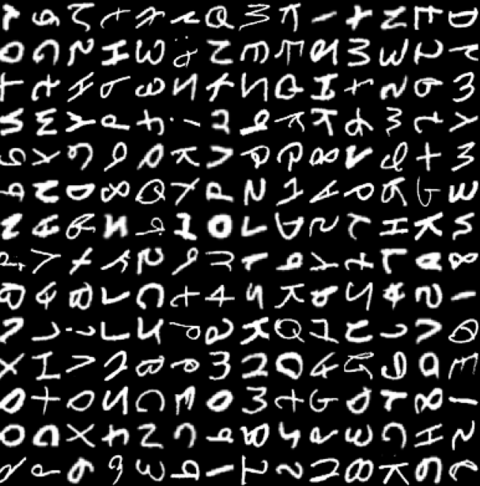

# English Character Recognition CNN

In this part of the project, we use the EMNIST dataset to train a CNN that'll recognize letters and numbers. In the next project, we'll make one that recognizes entire words. Then, we'll compare the upsides and downsides of each.

This README contains some notes on the mini-project, it will expand over time if and as needed.

## Dataset

The dataset being used here is EMNIST, which is an extension of the classic MNIST dataset. EMNIST includes handwritten letters as well as digits. There are 26 balanced classes of uppercase and lowercase letters (a total of 52 classes) in addition to the 10 digit classes from MNIST. In total, we have 814,255 training samples and 135,000 test samples, each represented as a 28×28 grayscale image. This data is to be pre-processed and then trained on to train the CNN.

## Architecture

We're going to prepare/train the CNN in 4 steps:

1. Load the data (`loader.py`)
2. Define the model (`model.py`)
3. Train the model (`train.py`)
4. Evaluate the model (`eval.py`)

We'll be using a VGG-style CNN.

### Convolution Blocks

We'll be using two VGG blocks. Both will consist of layers that have stride and padding of 1, with kernel sizes being 3x3. Each one is followed by maxpooling (for downsampling) and batch normalization (for regularization).

**Block 1**

- A Conv2D layer with 32 filters
- Passed into ReLU activation
- Another Conv2D layer with 32 filters
- ReLU again
- MaxPool2D with pool size of 2x2

**Block 2**

- Conv2D with 64 filters
- ReLU activation
- Another Conv2D with 64 filters
- ReLU again
- MaxPool2D with pool size of 2x2

**Block 3**
- Convd2D with 128 filters

**Block 4**
- Conv2D with 256 filters

### Dense Layers

Once the convolutions are done, we pass the data through a Flatten layer to convert the 2D matrices into a 1D vector. Then, we pass to the Dense layers. The first dense layer learns the features, and the second dense layer classifies.

## Results

I could've stopped the training at epoch 24, where the loss was just under 0.35. Note that this is actually decently accurate ($accuracy \neq 1 - \text{loss}$). Because of the loss function we're using, the model is punished/rewarded based on the confidence of its predictions, not just whether it's right or wrong. Also, after this point, we've hit the "elbow" of the loss curve, i.e. where the loss starts to plateau. This is because, in this dataset, there are many characters that are very difficult for even humans to tease apart, such as an uppercase `O` and the number `0`. Thus, in these cases, the model will never have high confidence, and so will always incur some loss.
