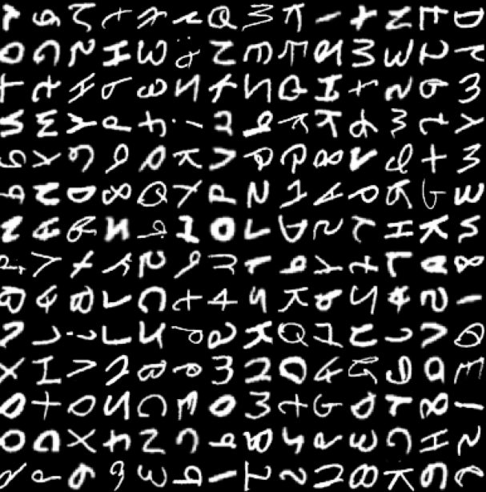

# English Character Recognition CNN

In this part of the project, we use the EMNIST dataset to train a CNN that'll recognize letters and numbers. In the next project, we'll make one that recognizes entire words. Then, we'll compare the upsides and downsides of each.

This README contains some notes on the mini-project, it will expand over time if and as needed.

## Dataset

The dataset being used here is EMNIST, which is an extension of the classic MNIST dataset. EMNIST includes handwritten letters as well as digits. There are 26 balanced classes of uppercase and lowercase letters (a total of 52 classes) in addition to the 10 digit classes from MNIST. In total, we have 814,255 training samples and 135,000 test samples, each represented as a 28×28 grayscale image. This data is to be pre-processed for training the CNN.

## Architecture

We're using a VGG-style architecture optimized for EMNIST. The network is composed of four repeating Convolutional Blocks, followed by a dense classification head.

### Block Structure

Each block contains two 3x3 Convolutional layers. Every convolution is immediately followed by Batch Normalization and ReLU activation. The block concludes with MaxPooling and Dropout (0.25) to ensure robust feature extraction without overfitting.

### Architecture

Block 1: 32 Filters (pool stride: 2)

Block 2: 64 Filters (pool stride: 2)

Block 3: 128 Filters (pool stride: 1)

Block 4: 256 Filters (pool stride: 1)

### Dense Layers

Flatten: Converts the final 256x5x5 feature map into a 1D vector.

Fully Connected: 512 units with Batch Normalization, ReLU, and Dropout (0.5).

Classifier: Output layer mapping to the 62 EMNIST classes.

## Results

Training stops at epoch 13, at which point validation and training losses diverge. We end with a final accuracy of 88.0196%. Note that $\text{accuracy} \neq 1 - \text{loss}$. This model, despite only being 89% accurate, is actually almost always right in production. Note that, because of the loss function we're using, the model is punished/rewarded based on the confidence of its predictions, not just whether it's right or wrong. As a result, it's encouraged to "confidently" predict answers even on meaningless images.

Also, after this point, we've hit the "elbow" of the loss curve, i.e. where the loss starts to plateau. This is because, in this dataset, there are many characters that are very difficult for even humans to tease apart, such as an uppercase `O` and the number `0`. Thus, in these cases, the model will never have high confidence, and so will always incur some loss.

### Implementation

The CNN was prepared in four steps:

1. Data preparation done in (`loader.py`)
2. Model definition done in (`model.py`)
3. Trained using (`train.py`)
4. Evaluated the model (`eval.py`)

Have a look at these files for details.
