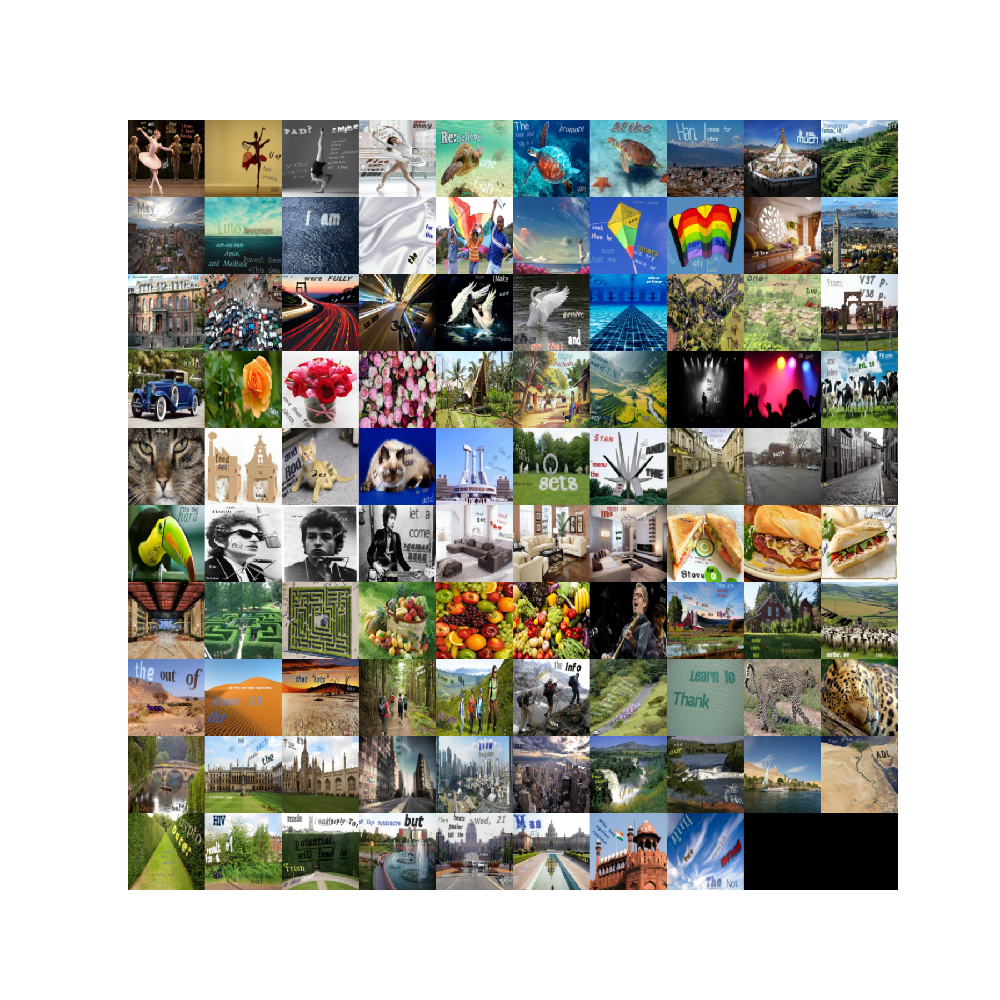

# English Word Recognition

Here, an end-to-end CNN model is built to recognize entire words from images. This is one step up from recognizing individual characters, as it involves understanding the context and structure of words.

This type of CNN trains directly on words, not on letters. If we had made a model that was really good at recognizing letters, we would have to take each picture, split it into a series of letters, recognize each letter individually, and then piece them back together into words. Although in theory this sounds like a simpler approaach than training on massive amounts of whole words, in practice it often leads to errors compounding and worse overall performance.

One issue with the former approach is the segmentation: there are countless different fonts, styles, spacings, and sizes. Another issue is that it's simply slower.

Recent advances, like [DeepSeek-OCR](https://deepseek.ai/blog/deepseek-ocr-context-compression)'s convolutional token aggregation, extend this by bundling words into compact visual representations for multimodal decoding, enabling 200K+ pages/day processing on single GPUs without explicit segmentation.

## Datasets

One famous dataset **Synth90k**, from the [Synthetic Data and Artificial Neural Networks for Natural Scene Text Recognition]((https://arxiv.org/abs/1406.2227)) paper by Jaderberg et al. (2014).

It consists of a bunch of synthetically generated images of words in various fonts, colors, backgrounds, and distortions. For future implementations, one can take inspiration from this paper to, for example, create a more efficient version of the same dataset, make the data more complex, or even create the same kind of dataset for a different language.

In total, we have a vocabulary of about 90,000. The dataset is about 12 GB in size, containing 9 million pictures of individual words or numbers. Because there's so much data, we can give the model tons of examples to learn from, which should help it generalize better to new words.

Each sample has an image and its corresponding text label. The images vary in size, so we'll need to preprocess them (like resizing and normalizing) before feeding them into the CNN for training. When training, PyTorch can only work with PIL/NumPy images, so we'll convert the images from their original format to that during preprocessing. This shouldn't be too hard with the HuggingFace datasets library.

However, a better database would be SynthText, from the paper [Synthetic Data for Text Localisation in Natural Images](https://arxiv.org/abs/1604.06646) by Gupta et al. (2016). This dataset is more complex and realistic, as it places text in natural scenes, like street signs, billboards, and shop names. It contains about 900,000 images, with roughly 9 words on average per image. This dataset is better since it actually places the text in real-world images, so the learning that the CNN will do is more useful for practical applications.

When downloading from HuggingFace using the `../utils/import_st.py` script, the dataset will end up being roughly 33 GB in size. There are 85 `.tar` files, with an average size of ~560 MB. You can download it "manually" as well, such as from Kaggle [Kaggle](https://www.kaggle.com/datasets/wassefy/synthtext).

Then, the data needs to be preprocessed as well, since the text is embedded in larger images. `loader.py` script handles this.

## Architecture

The CNN architecture itself is the focus of *this* project.

We may want to follow the next paper by Jaderberg et al, [Synthetic Data and Artificial Neural Networks for Natural Scene Text Recognition
](https://arxiv.org/abs/1507.05717) (2014). It three introduces different architectures: DICT, CHAR, and NGRAM. DICT is the main focus, and so it'll be the one that I'm implementing here. The DICT architecutre consists of:

- 4 Convolutional Layers
  - Conv1: 64 filters, 5×5, stride 1, pad; ReLU → LRN → MaxPool(2×2)
  - Conv2: 128 filters, 5×5; ReLU → LRN → MaxPool(2×2)
  - Conv3: 256 filters, 3×3; ReLU
  - Conv4: 512 filters, 3×3; ReLU → MaxPool(2×2)
- 2 Fully Connected Layers, both with ReLU activations and Dropout. Usually 4096 neurons each.
- Softmax for Classifcation

Notice that this architecture is pretty big. Even if you had pretty strong specs by today's standards, which would be something like an RTX 5080 with 12GB VRAM, a strong 12-core AMD CPU, etc., it would still take about an hour and a half to train a single epoch on the full Synth90k dataset. Note that this is already some 10x faster thant he hardware they had back when this paper was published. As such, training this architecture to convergence would take days, if not weeks. There are simply so many parameters that it's not worth the time investment, at least for this project.

Not the mention, this architecture has some limitations as well. It's practically acting as a 90-thousand-word classifier, so it can't recognize words outside of its training vocabulary. For example, if one of our dictionaries misses a new slang term, has a typo, or simply misses rare words, the model will choke.

Instead, I will opt for using a different architecture: A **CRNN** (Convolutional Recurrent Neural Network) with **CTC** (Connectionist Temporal Classification) loss. This architecture combines CNNs for feature extraction and RNNs for sequence modeling, making it well-suited for recognizing variable-length text sequences, arbitrary sequences of characters, and can generalize for different fonts, handwriting styles, and distortions.

Most importantly, this type of model is a lot simpler and faster to train than the one from the earlier paper. The basic idea is that it looks at the inputted image for words, and iterates "forwards" through the image, hence the recurrence. This way, it can recognize sequences of characters without needing to classify each word individually.

We'll also be using the [SynthText](https://arxiv.org/abs/1604.06646) dataset, since it's more complex and realistic. This dataset has several words placed in a variety of natural scenes, randomly mixed, and with random fonts and styles. This helps the model generalize.

Now, since we're dealing with complex sequences of words, we also need a way to detect and split up the words. The CRNN itself is only a tool for categorizing (or 'transcribing') the word, but we need to first recognize them in the first place. This requires some sort of text detector. Since the material behind this isn't quite relevant for this project, I'll just be reusing `DBNET++` recognizer that's build into `PyTorch`. The CRNN will have VGG-style convolutions followed by a bidirectional LSTM, passed into dense layers for learning and softmax for classification. More specifically, our architecture will consist of:

### Preprocessing

- No extra distortions; the original dataset already has enough warps, rotations, and perspective changes
- Load images in using PIL, convert to grayscale
- In each image, detect text regions using DBNET++
- Crop detected text regions, resize to fixed height (e.g., 32 pixels)
- Pass resized images to the CRNN model

### CNN + RNN

- Convolutional Block 1: 2 convolution layers, 64 filters each, 3×3 kernel, ReLU activation, max pooling 2×2
- Convolutional Block 2: 2 convolution layers, 128 filters each, 3×3 kernel, ReLU activation, max pooling 2×2
- Convolutional Block 3: 3 convolution layers, 256 filters each, 3×3 kernel, ReLU activation, max pooling 2×2
- Convolutional Block 4: 3 convolution layers, 512 filters each, 3×3 kernel, ReLU activation, max pooling 2×1
- Convolutional Block 5: 3 convolution layers, 512 filters each, 3×3 kernel, ReLU activation, max pooling 2×1
- Bidirectional LSTM layers: 2 layers, hidden size 256 each

### Feedforward + Classification

- Dense layers: 1–2 fully connected layers depending on output size
- Classification layer: final softmax over character set

We're using CTC (Connectionist Temporal Classification) Loss as our loss function. I won't be implementing this from scratch, instead I'll just use PyTorch's built-in `nn.CTCLoss`. The point of this loss function is to take some variable-length sequence (like a word) and align it with the model's predictions, even if the predictions are longer or shorter than the actual sequence. This is super useful for text recognition, where words can have different lengths.

Effectively, this model is kind of like an expansion of the one that we made for EMNIST character recognition. Of course, it, too, has limitations. For example, it may struggle with weird fonts, strong distorations, highly diagonalized text, overlapping characters, or whatever else may be missing from the training data. However, SynthText does contain a big chunk of these features. Even still, an even stronger version of this model could be made by adding attention mechanisms, transformer layers, or other modern deep learning techniques.

This model is defined in `model.py`. The training loop is in `train.py`, and the data loading is in `chars/loader.py`. Follow along!
